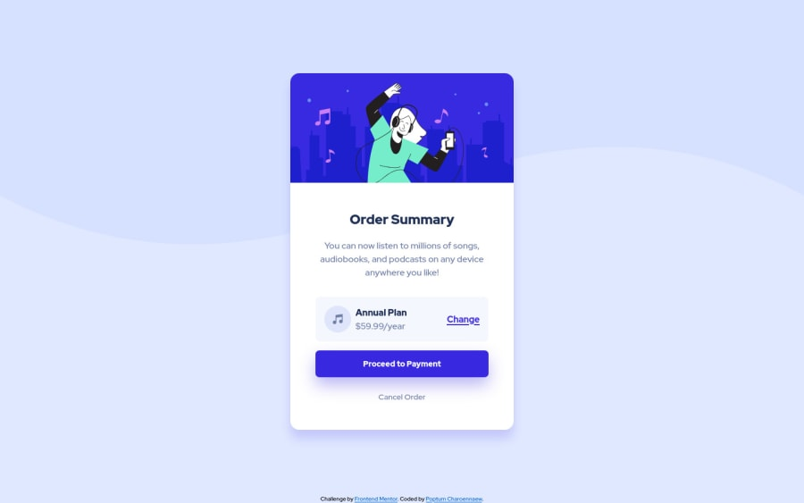

<!--  -->

# Frontend Mentor - Order summary card solution

This is my solution to the [Order summary card challenge on Frontend Mentor](https://www.frontendmentor.io/challenges/order-summary-component-QlPmajDUj). Frontend Mentor challenges help you improve your coding skills by building realistic projects. 

## Table of contents

- [Overview](#overview)
  - [The challenge](#the-challenge)
  - [Links](#links)
- [Built with](#built-with)
- [Author](#author)
- [Acknowledgments](#acknowledgments)

## Overview

### The challenge

Users should be able to:

- See hover states for interactive elements

### Links

<!-- - Solution URL: [Frontend Mentor](https://pepper99.github.io/order-summary-component/index.html) -->
- Live Site URL: [GitHub Pages](https://pepper99.github.io/order-summary-component/index.html)

## Built with

- Semantic HTML5 markup
- CSS custom properties
- Flexbox
- [Sass](https://sass-lang.com/) - CSS extension

## Author

<!-- - Website - [Add your name here](https://www.your-site.com) -->
- Frontend Mentor - [@pepper99](https://www.frontendmentor.io/profile/pepper99)
- LinkedIn - [Poptum Charoennaew](https://www.linkedin.com/in/poptum-cnaew)

## Acknowledgments

This [YouTube video from Dev Ed](https://www.youtube.com/watch?v=Zz6eOVaaelI) really helped me getting started on using Sass, if you're learning it, might want to check it out!